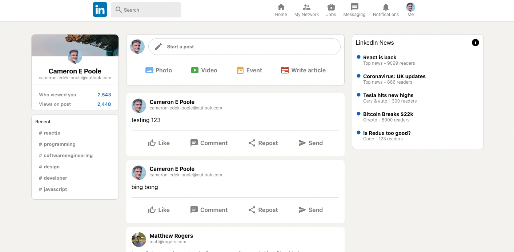

# LinkedIn Clone

Link to deployed app: https://linkedin-clone-a0247.web.app 

## Description

This is a LinkedIn clone built with React, Redux and Firebase's NoSQL cloud database and Authentication. It allows users to create an account, login, and post messages. Users can also logout by pressing their profile image in the top right hand corner. Redux has been used to store the user's information - it keeps tabs on whether the user is logged in or out. The messages are stored on Cloud Firestore (NoSQL database) and are displayed on the home page - they are updated and shown in real time. This project was built via a tutorial by [Sonny Sangha](https://www.youtube.com/watch?v=tbvguOj8C-o&t=17920s&ab_channel=SonnySangha) on YouTube.

#### Technologies Used:
- React.js
- Redux
- Firebase (Cloud Database, Authentication)
- Material UI Icons
- CSS

 ## Installation
 N/A

## Usage

Screenshot of the app:

To log in, create a new account with an email and password. You can then post messages by typing in he feed input header and logout by pressing your profile image in the top right hand corner.

 

## Credits
- [Sonny Sangha](https://www.youtube.com/watch?v=tbvguOj8C-o&t=17920s&ab_channel=SonnySangha) for the tutorial on YouTube

## License
N/A

--- 
## Questions

If you have any questions about the repo, open an issue or contact me directly at cameron-edek-poole@gmail.com. 

You can find more of my work by clicking on my GitHub username: [cedekpoole](https://github.com/cedekpoole/).
Feel free to also add me on [LinkedIn](https://www.linkedin.com/in/cam-edek-poole/)!
